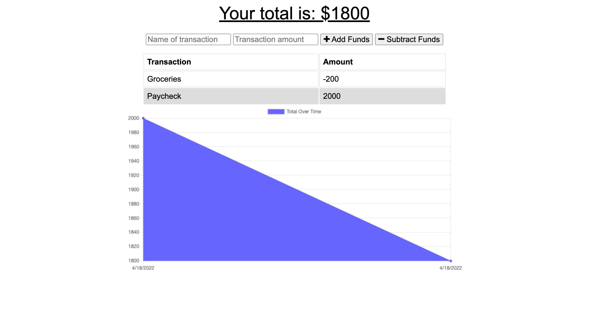

# Budget Tracker

## Description
---
A PWA you can use to keep and maintain a budget. The application has both online access and functionality. The applications uses Node.js, Express.js, MongoDb and Mongoose to create functionality

## Table of Contents
- [Installation](#installation)
- [Usage](#usage)
- [Questions](#questions)
- [License](#license)

## Installation
To install, first, open the deployed application. Then click the 'Install' button located in the URL bar.

## Usage
To use the application input the name of the transaction, the transaction amount,, and then select whether you will be adding or subtrating this amount from you budget. For example, if you receive a paycheck, the name of the transaction will be "paycheck," the amount of the trasaction will be the dollar amount of the paycheck and then finally, you will click the "+ Add Funds" button.

## Questions
You can reach me through GitHub or E-mail

[GitHub Profile](https://www.github.com/perfect-perfect/)

gilberto.j.covarrubias@gmail.com
    
## License
[MIT License](https://choosealicense.com/licenses/mit/)